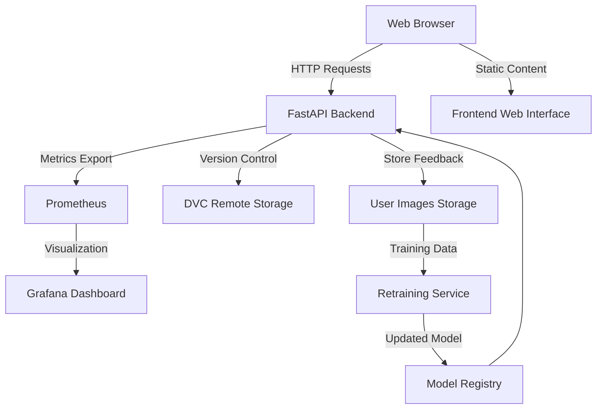

# Fashion Classifier

## Table of Contents
- [1. Architecture Diagram](#1-architecture-diagram)
- [2. Installation & Setup](#2-installation--setup)
- [3 High-Level Design Document](#3-high-level-design)
- [4 Low-Level Design Document](#4-low-level-design)
- [5. User Manual](#5-user-manual)
- [6. Troubleshooting Guide](#6-troubleshooting-guide)
  
## 1. Architecture Diagram


## 2. Installation & Setup


1. Clone repository
```
git clone https://github.com/megh-m/Fashion_Classifier.git
cd Fashion_Classifier
```
2. Run setup.sh
```
chmod +x setup.sh
./setup.sh
```
3. Start services
```
docker-compose up -d --build
```
4. Access services
- Web Interface: http://localhost:80
- API Docs: http://localhost:5001/docs
- Grafana: http://localhost:3000

**Key Components:**
- **FastAPI Backend**: Core application logic and REST API endpoints
- **User Images Storage**: Directory for user-submitted images with correct/incorrect classifications
- **DVC Remote Storage**: Version-controlled data and model storage
- **Prometheus**: Metrics collection and monitoring
- **Grafana**: Visualization dashboard for operational metrics
- **Retraining Service**: Periodic model updates using new data
- **Frontend Web Interface**: User-friendly UI for image submission and feedback

## 3 High-Level Design

**Design Choices & Rationale:**
1. **REST API Architecture**: 
   - FastAPI for async support and OpenAPI documentation
   - Enables easy integration with multiple clients (web, mobile, CLI)

2. **Progressive Model Training**:
   - Initial training on Fashion-MNIST dataset
   - Continuous scheduled retraining with user feedback data
   - Layer freezing for efficient fine-tuning on new data

3. **Observability Stack**:
   - Prometheus for metrics collection (QPS, latency, accuracy)
   - Grafana for real-time visualization
   - Evidently AI for data drift detection

4. **MLOps Infrastructure**:
   - Docker containers for environment consistency
   - DVC for dataset and model versioning
   - Automated CI/CD pipeline for model updates

5. **Security**:
   - API key authentication for critical endpoints
   - Input validation and sanitization
   - Rate limiting (future extension)

## 4 Low-Level Design

**API Endpoint Specifications:**

| Endpoint | Method | Input | Output | Description |
|----------|--------|-------|--------|-------------|
| `/predict` | POST | Image file | Prediction JSON | Classify fashion item |
| `/feedback` | POST | JSON feedback | Status message | Submit prediction feedback |
| `/retrain` | POST | API key | Status message | Trigger model retraining |
| `/metrics` | GET | - | Prometheus metrics | Export monitoring metrics |
| `/health` | GET | - | Health status | Service health check |

**Example IO Specification:**

```
// POST /predict Response
{
"filename": "20231020_123456_abc123.jpg",
"predicted_class": "Dress",
"confidence": 92.45,
"prediction_time_ms": 156.78
}

// POST /feedback Request
{
"image_id": "20231020_123456_abc123.jpg",
"is_correct": false,
"predicted_class": "Dress",
"actual_class": "Coat"
}
```
## 5. User Manual

**For Non-Technical Users:**

1. **Access Web Interface**
   - Open browser to `http://localhost:80`
   - Click "Select Image" button

2. **Get Prediction**
   - Select fashion item image (JPG/PNG)
   - View predicted class and confidence

3. **Provide Feedback**
   - Click 'Yes'/'No' after prediction
   - For incorrect predictions:
     - Select actual class from dropdown
     - Click 'Submit'
     - Wait for success response from app

4. **View Statistics**
   - Access Dashboard tab
   - Monitor real-time accuracy metrics
   - View system health indicators

5. **Setting up Periodic Retraining**
   - Add a Crontab entry to run the retraining service docker container at a specified time of day
     ```
     crontab -e
     ```
     Then add
     ```
     MM HH * * * cd <File_Path to Unzip Location> && docker start ai_app_ra-retraining-service-1
     ```
     This will run the retraining service at HH:MM hrs local time everyday

**For Administrators:**
1. **Access Grafana Dashboard**
   - Setup Grafana on your system locally without docker 
   - Navigate to `http://localhost:3000`
   - Use credentials provided
   - Setup Dashboard to view
     - Prediction throughput
     - Model accuracy trends
     - System resource usage
     - Data drift alerts
## 6. Troubleshooting Guide

### Common Errors and Solutions

| Error Message | Possible Cause | Resolution |
|--------------|----------------|------------|
| 422 Unprocessable Entity | Invalid API request format | Ensure requests use form-data instead of JSON |
| "Model not loaded" error | Missing model file | Run initial training with `dvc repro train_initial_model` |
| Port 5001 already in use | Another service using port | Change port in `uvicorn.run(port=NEW_PORT)` |
| Prometheus metrics not visible | Registry configuration mismatch | Verify metrics use custom registry in `app.py` |
| Feedback images not saving | Docker volume permissions | Run `sudo chmod -R a+rw data/ models/` on host |
| "Address already in use" | Multiple metric servers | Use FastAPI-mounted metrics endpoint only |
| Drift detection not working | Insufficient batch size | Ensure >10 predictions before checking metrics |
| Retraining fails silently | CUDA out of memory | Reduce batch size in `retrain.py` arguments |
| "Invalid class name" error | Class name formatting | Use exact names from ClassLabels enum |

### API-Specific Issues

**Problem**: `/reload-model` returns 403 Forbidden
- **Cause**: Invalid or missing API key
- **Fix**: Set environment variable before starting

```
export RELOAD_KEY="your-secret-key"
```
**Problem**: Predictions return inconsistent results
- **Cause**: Model not reloaded after retraining
- **Fix**: Manually trigger reload
```
curl -X POST http://localhost:5001/reload-model -d "api_key=YOUR_KEY"
```
### Metrics & Monitoring Issues

**Problem**: Grafana dashboard shows "No data"
1. Check Prometheus targets: `http://localhost:9090/targets`
2. Verify metrics endpoint: `curl http://localhost:5001/metrics`
3. Ensure scrape interval in `prometheus.yml` is ≤1m
